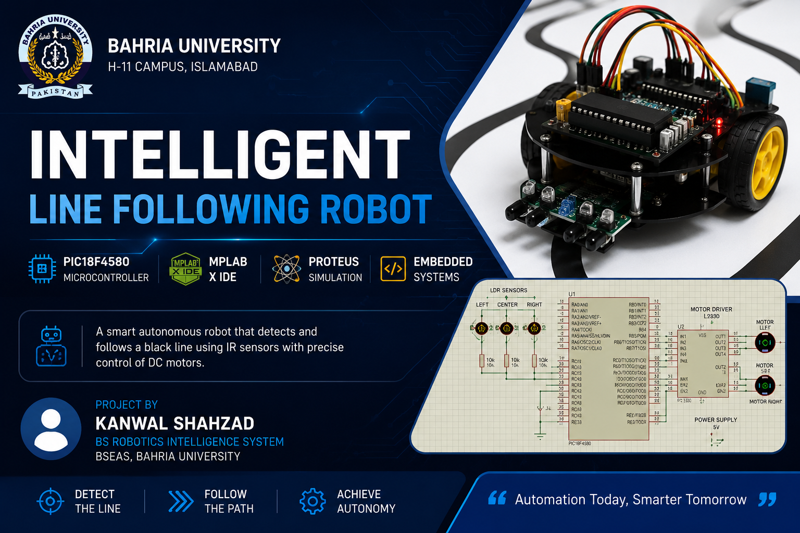
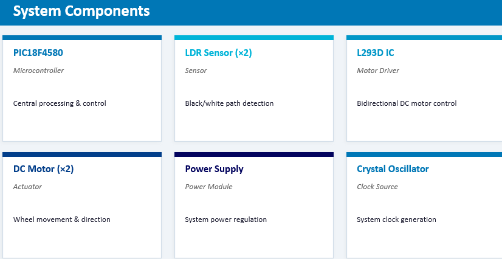
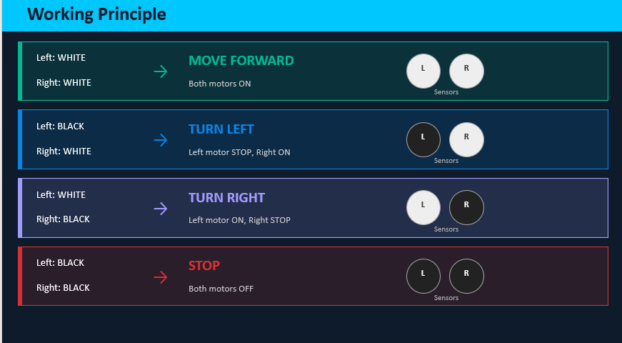
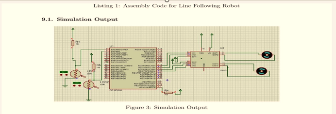

<p align="center">
  
</p>

# 🤖 Intelligent Line Following Robot using PIC18F4580

## 📖 Project Overview

This project was developed as part of the Embedded Systems Design (ESD) course at Bahria University.

The robot follows a predefined path by detecting black and white surfaces using LDR sensors. The control logic was implemented in Assembly Language using MPLAB IDE, and the complete circuit was designed and simulated in Proteus.

---

## 🎯 Objectives

- Design an intelligent line-following robot.
- Implement Assembly Language programming on PIC18F4580.
- Simulate the complete circuit in Proteus.
- Control DC motors using the L293D motor driver.

---

## 🛠️ Technologies Used

| Category | Technology |
|----------|------------|
| Microcontroller | PIC18F4580 |
| Programming | Assembly Language |
| IDE | MPLAB IDE |
| Simulation | Proteus |
| Motor Driver | L293D |
| Sensors | LDR Sensors |
| Actuators | DC Motors |

---

## 📂 Repository Structure

```
Intelligent-Line-Following-Robot-PIC18F4580
│
├── README.md
├── LICENSE
├── cover.png
├── Components.png
├── working.png
├── proteus.png
├── Documentation/
└── Source_Code/
```

---

## 👨‍💻 Team Members

- **Kanwal Shahzad**
- **Rida Saman**

---

## 🎓 University

**Bahria University**

Department of Electrical Engineering

Embedded Systems Design (ESD)

2026

---

# 📸 Project Preview

## 🧩 System Components



---

## ⚙️ Working Principle



---

## 💻 Proteus Circuit



---

## 🚀 Features

- Intelligent line following
- LDR sensor-based path detection
- PIC18F4580 Microcontroller
- Assembly Language Programming
- Proteus Simulation
- Dual DC Motor Control
- L293D Motor Driver

---

## 📌 Author

**Kanwal Shahzad**

BS Robotics Intelligence System

Bahria University
